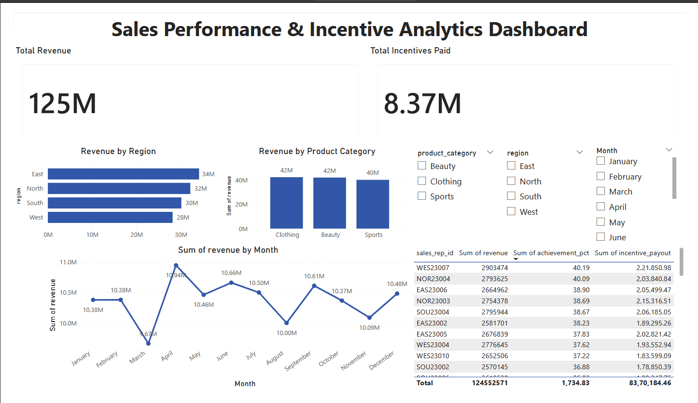
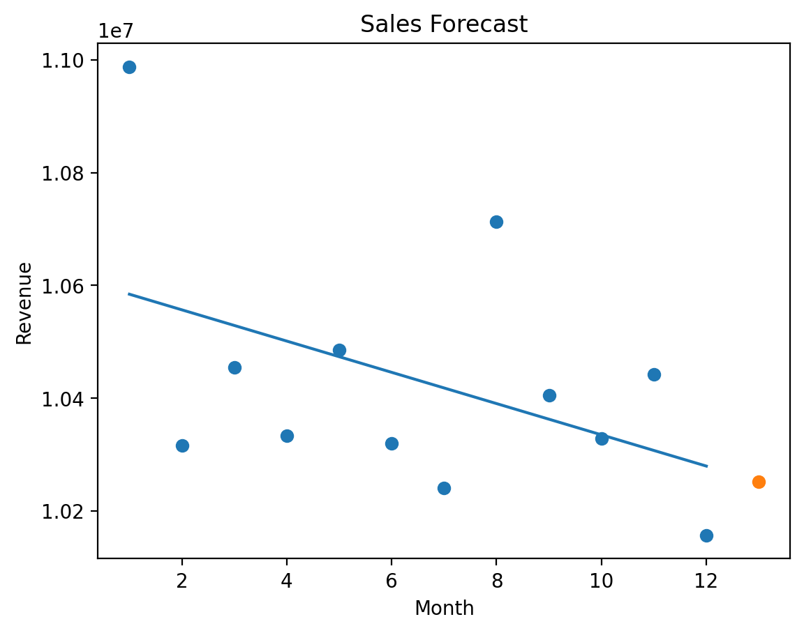

# Sales Performance & Incentive Analytics

A data analytics project that analyzes sales performance, evaluates incentive compensation models, and visualizes business insights through an interactive Power BI dashboard.

---

## Overview

This project simulates a retail company's sales analytics workflow. It demonstrates how sales data can be processed using Python and SQL, analyzed to extract insights, and visualized through an executive dashboard.

The system evaluates:

- Regional sales performance
- Product category trends
- Sales representative performance
- Incentive compensation effectiveness
- Monthly revenue forecasting

The goal is to simulate a real-world analytics pipeline used by data analysts and business intelligence teams.

---

## Tech Stack

- Python  
- Pandas  
- NumPy  
- SQL (SQLite)  
- Power BI  
- Matplotlib  
- Scikit-learn  

---

## Project Structure

```
sales_performance_analytics
│
├─ dashboard
│   └─ sales_dashboard.pbix
│
├─ data
│   ├─ raw
│   ├─ processed
│   └─ sales.db
│
├─ notebooks
│   ├─ data_generation.ipynb
│   └─ sql_analysis.ipynb
│
├─ reports
│   ├─ dashboard.png
│   ├─ sales_forecast.png
│   └─ business_insights.md
│
├─ sql
│   └─ analytics_queries.sql
│
├─ requirements.txt
├─ README.md
└─ LICENSE
```

---

## Data Pipeline

```
Synthetic Data Generation
        ↓
Data Processing (Pandas)
        ↓
SQL Database Creation (SQLite)
        ↓
SQL Analytics Queries
        ↓
Business Metrics & KPI Analysis
        ↓
Power BI Dashboard Visualization
        ↓
Sales Forecasting Model
```

---

## Key Features

### Sales Performance Analysis

Analyzed sales data to identify revenue distribution across regions, product categories, and sales representatives.

### Incentive Compensation Model

Implemented a tiered incentive structure based on target achievement:

- <70% target → reduced incentive  
- 70–100% target → gradually increasing commission  
- >100% target → maximum incentive rate  

### SQL-Based Analytics

Created SQL queries to compute core business metrics:

- Revenue by region
- Revenue by product category
- Monthly revenue trend
- Top performing sales representatives
- Incentive payout by region

All queries are available in:

```
sql/analytics_queries.sql
```

### Interactive Dashboard

Built a Power BI dashboard containing:

- Total revenue KPI
- Total incentive payout KPI
- Revenue by region
- Revenue by product category
- Monthly sales trend
- Filters for region, category, and month

Dashboard file:

```
dashboard/sales_dashboard.pbix
```

Preview:



---

## Sales Forecasting

A simple regression model was implemented to predict future monthly revenue.

Steps:

1. Aggregate monthly sales
2. Train a linear regression model
3. Predict the next month's revenue
4. Visualize forecast results

Forecast visualization:



---

## Example Business Insights

- Total simulated revenue ≈ **125M**
- Total incentive payout ≈ **8.37M**
- **East region** generated the highest revenue
- **Clothing category** contributed the largest share of sales
- Several sales representatives exceeded **100% target achievement**
- Revenue trend shows relatively stable monthly sales with occasional peaks

---

## Learning Objectives

This project demonstrates practical skills used in analytics roles:

- Data cleaning and transformation
- SQL analytics queries
- KPI design and incentive modeling
- Dashboard development
- Business insight generation
- Basic forecasting models

---

## Dataset

A sample dataset is provided for demonstration:

data/sample_sales_data.csv

The full dataset can be generated using the notebook:

notebooks/data_generation.ipynb

## Installation

Clone the repository:

git clone https://github.com/yourusername/sales-performance-analytics

Install dependencies:

pip install -r requirements.txt

## License

This project is licensed under the **GNU General Public License v3.0 (GPLv3)**.

See the LICENSE file for details.

## Author

Ahan  
Data Analytics / Business Intelligence Project